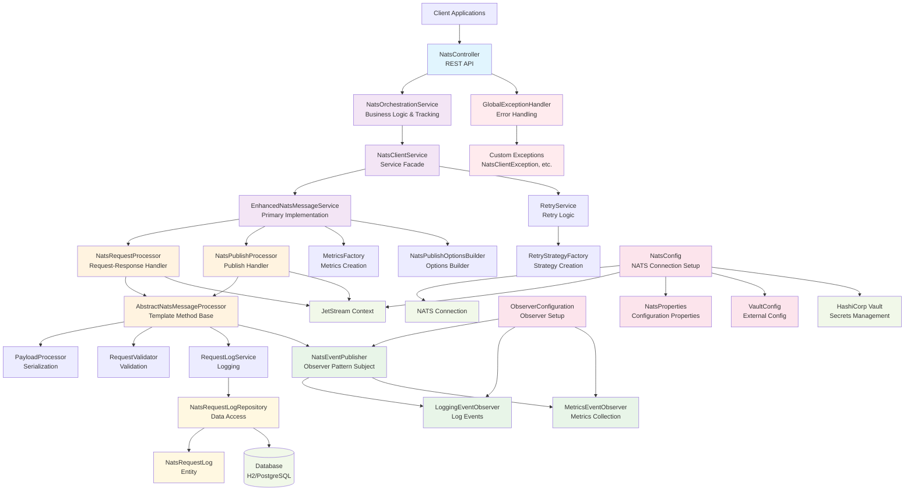
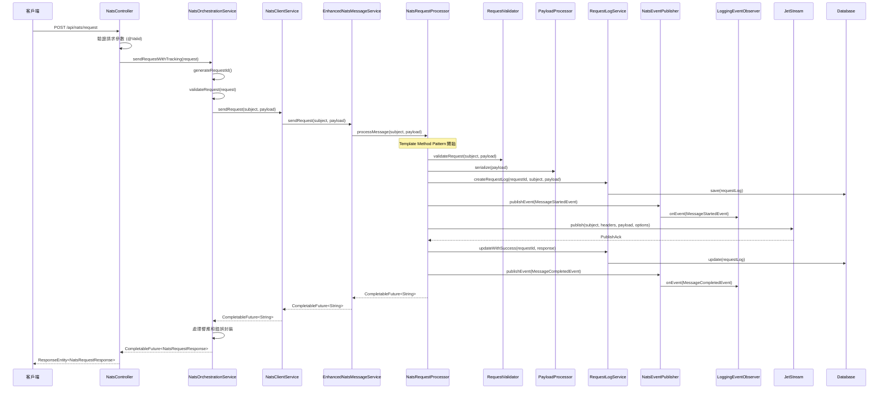
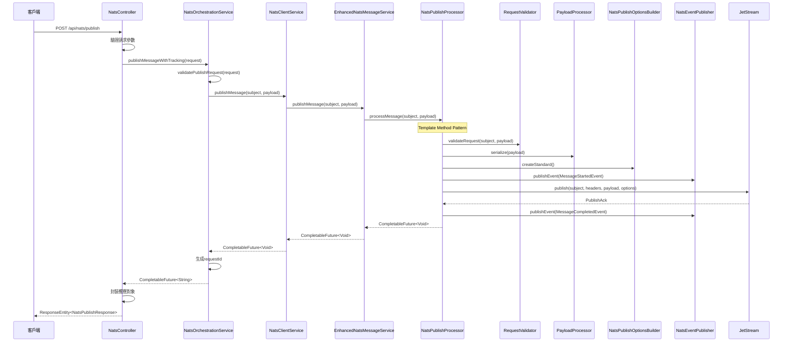
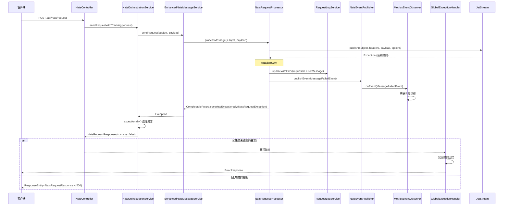
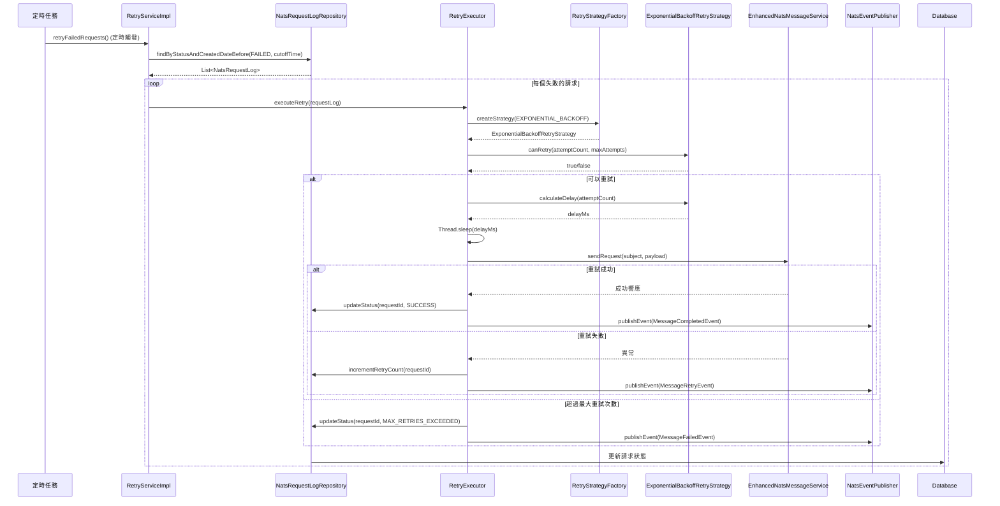
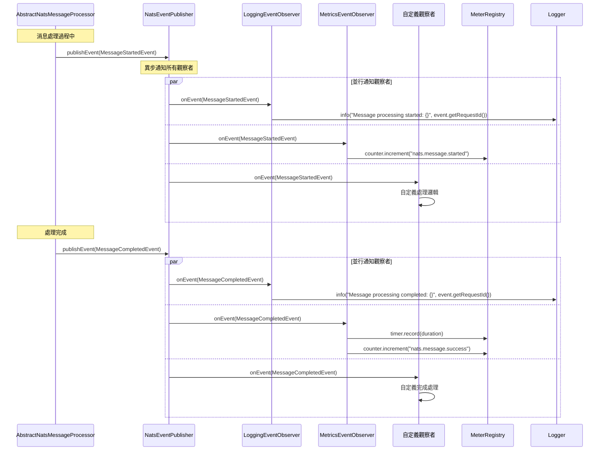
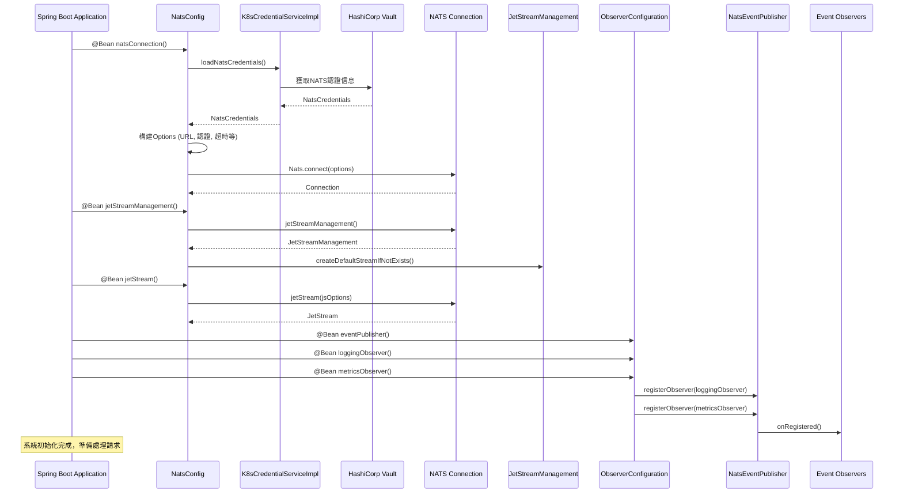

# NATS Client Architecture

## 系統概覽

本NATS客戶端系統採用分層架構設計，整合了多種設計模式，提供高可靠性、可維護性和可擴展性的消息通信解決方案。

## 架構圖



## 架構分層

### 1. 控制層 (Controller Layer)
- **NatsController**: 提供REST API接口，處理HTTP請求
- 支援的操作：
  - 發送請求 (`/api/nats/request`)
  - 發布消息 (`/api/nats/publish`)
  - 查詢狀態 (`/api/nats/status`)
  - 獲取統計 (`/api/nats/statistics`)

### 2. 業務編排層 (Orchestration Layer)
- **NatsOrchestrationService**: 業務邏輯編排和請求追蹤
- 功能：
  - 請求驗證和預處理
  - 請求ID生成和管理
  - 統計數據收集
  - 錯誤處理和響應封裝

### 3. 服務層 (Service Layer)
- **NatsClientService**: 服務門面模式，統一對外接口
- **EnhancedNatsMessageService**: 主要實現，使用JetStream進行可靠消息處理
- **RetryService**: 重試機制實現

### 4. 處理器層 (Processor Layer)
採用**Template Method模式**：
- **AbstractNatsMessageProcessor**: 定義消息處理的通用流程
- **NatsRequestProcessor**: 專門處理請求-響應模式
- **NatsPublishProcessor**: 專門處理發布模式

### 5. 支援服務層 (Support Services)
- **PayloadProcessor**: 負責序列化/反序列化
- **RequestValidator**: 請求驗證邏輯
- **RequestLogService**: 請求日誌記錄
- **事件系統**: Observer模式實現的事件通知機制

### 6. 基礎設施層 (Infrastructure Layer)
- **NATS Connection**: 基本NATS連接
- **JetStream**: 提供持久性和可靠性
- **Database**: 請求日誌持久化
- **Vault**: 安全配置管理

## 設計模式應用

### 1. Template Method Pattern
```java
// AbstractNatsMessageProcessor 定義處理流程模板
public abstract class AbstractNatsMessageProcessor<T> {
    public final CompletableFuture<T> processMessage(String subject, Object payload) {
        // 1. 生成requestId
        // 2. 驗證
        // 3. 預處理  
        // 4. 執行具體處理 (抽象方法)
        // 5. 後處理
        // 6. 事件發布
    }
    
    protected abstract CompletableFuture<T> executeSpecificProcessing(String requestId, String subject, Object payload, Instant startTime);
}
```

### 2. Observer Pattern
```java
// 事件發布者
@Component
public class NatsEventPublisher {
    private final List<NatsMessageEventObserver> observers;
    
    public void publishEvent(NatsMessageEvent event) {
        // 通知所有觀察者
    }
}

// 具體觀察者
@Component
public class LoggingEventObserver implements NatsMessageEventObserver {
    public void onEvent(NatsMessageEvent event) {
        // 記錄事件日誌
    }
}
```

### 3. Factory Pattern
```java
@Component
public class MetricsFactory {
    public Counter createCounter(String name, String description) {
        // 創建計數器指標
    }
    
    public Timer createTimer(String name, String description) {
        // 創建計時器指標
    }
}
```

### 4. Builder Pattern
```java
@Component
public class NatsPublishOptionsBuilder {
    public PublishOptions createCritical() {
        // 構建關鍵操作的發布選項
    }
    
    public PublishOptions createStandard() {
        // 構建標準操作的發布選項
    }
}
```

### 5. Strategy Pattern
```java
public interface RetryStrategy {
    long calculateDelay(int attemptNumber);
}

@Component
public class ExponentialBackoffRetryStrategy implements RetryStrategy {
    public long calculateDelay(int attemptNumber) {
        return (long) Math.pow(2, attemptNumber) * baseDelay;
    }
}
```

## 核心功能特性

### 1. JetStream 支援
- 消息持久化存儲
- 自動重試和確認機制
- 消息去重功能
- 流式處理能力

### 2. 異步處理模型
- 基於CompletableFuture的異步操作
- 非阻塞式消息處理
- 事件驅動的通知機制

### 3. 請求追蹤系統
- 唯一請求ID (REQ-{UUID} 格式)
- 完整的請求生命週期記錄
- 狀態查詢和統計功能
- 簡化的單一ID系統，提高追蹤效率

### 4. 監控和指標
- Micrometer集成
- 自定義業務指標
- 系統健康檢查

### 5. 配置管理
- 多環境配置支援
- HashiCorp Vault集成
- Kubernetes配置映射支援

### 6. 容錯機制
- 連接重試和斷線重連
- 消息重試策略
- 全局異常處理
- 慢消費者檢測

## 數據流程序列圖

### 1. 請求處理序列圖



### 2. 發布處理序列圖



### 3. 錯誤處理序列圖



### 4. 重試機制序列圖



### 5. 觀察者模式事件流程圖



### 6. 系統初始化序列圖



## 配置要點

### NATS連接配置
```yaml
nats:
  url: nats://localhost:4222
  connection-name: nats-client
  jetstream:
    enabled: true
    domain: default
    stream:
      default-name: NATS_STREAM
```

### JetStream配置
```yaml
nats:
  jetstream:
    stream:
      subjects: ["requests.*", "events.*"]
      storage: FILE
      max-age: 86400000  # 24小時
      replicas: 1
```

## 擴展指南

### 1. 新增處理器
繼承`AbstractNatsMessageProcessor`並實現`executeSpecificProcessing`方法。

### 2. 新增觀察者
實現`NatsMessageEventObserver`接口並註冊到`NatsEventPublisher`。

### 3. 自定義重試策略
實現`RetryStrategy`接口並註冊到`RetryStrategyFactory`。

### 4. 新增指標
使用`MetricsFactory`創建新的業務指標。

## 安全考慮

- 使用Vault管理敏感配置
- 支援多種NATS認證方式
- 請求驗證和數據清理
- 異常信息過濾，避免敏感信息洩露

## 性能優化

- 連接池管理
- 異步非阻塞處理
- JetStream批處理
- 配置調優建議

這個架構設計旨在提供一個可靠、可維護、可擴展的NATS客戶端解決方案，適用於企業級微服務通信場景。