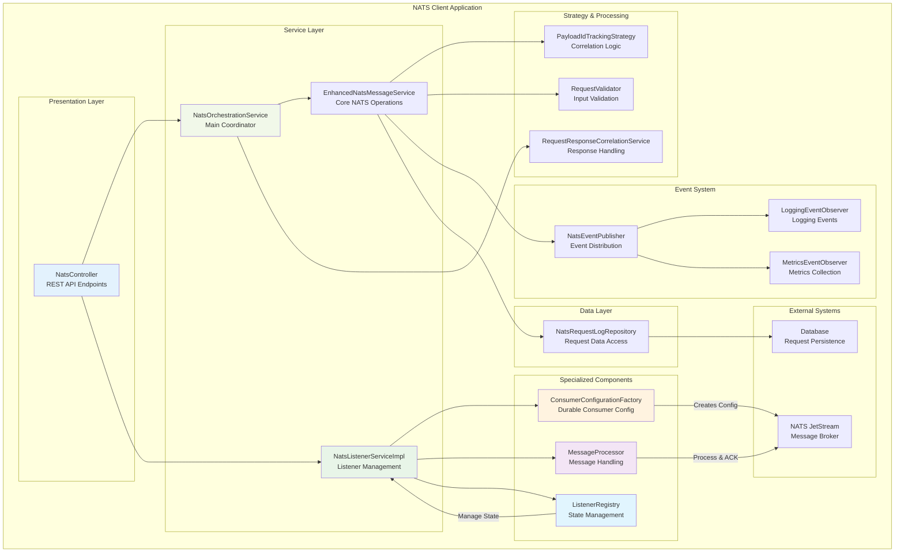
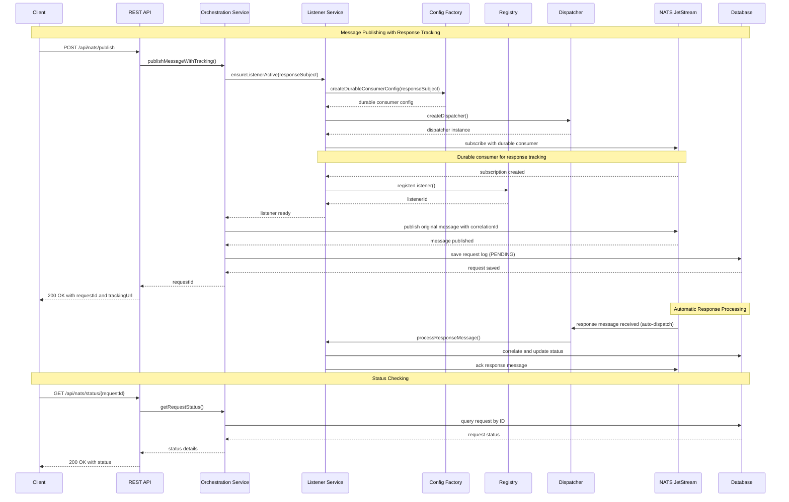
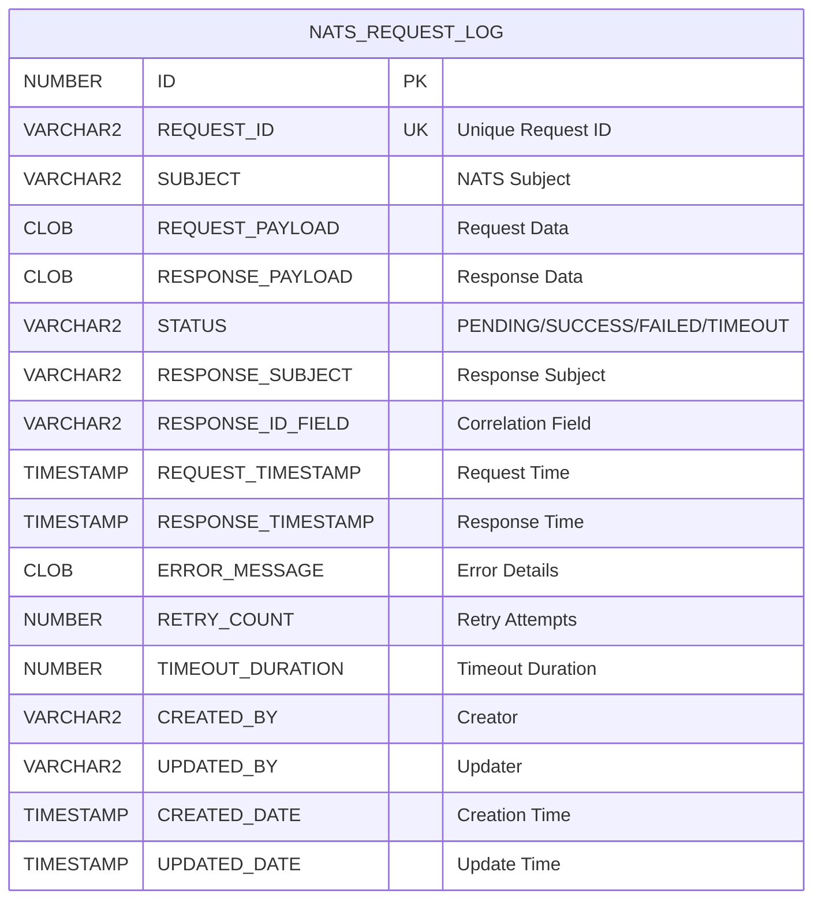

# NATS Client Architecture Diagrams

本文檔包含了 NATS Client 應用程序的詳細架構圖表，使用 Mermaid 格式繪製。

---

## 1. 應用程序內部架構

```mermaid
graph TB
    subgraph "NATS Client Application"
        subgraph "Presentation Layer"
            CTRL[NatsController<br/>REST API Endpoints]
        end
        
        subgraph "Service Layer"
            ORCH[NatsOrchestrationService<br/>Main Coordinator]
            LISTENER_IMPL[NatsListenerServiceImpl<br/>Listener Management]
            ENHANCED[EnhancedNatsMessageService<br/>Core NATS Operations]
        end
        
        subgraph "Specialized Components"
            CONFIG_FACTORY[ConsumerConfigurationFactory<br/>Durable Consumer Config]
            MESSAGE_PROC[MessageProcessor<br/>Message Handling]
            REGISTRY[ListenerRegistry<br/>State Management]
        end
        
        subgraph "Strategy & Processing"
            STRATEGY[PayloadIdTrackingStrategy<br/>Correlation Logic]
            VALIDATOR[RequestValidator<br/>Input Validation]
            CORRELATION[RequestResponseCorrelationService<br/>Response Handling]
        end
        
        subgraph "Event System"
            PUBLISHER[NatsEventPublisher<br/>Event Distribution]
            LOG_OBS[LoggingEventObserver<br/>Logging Events]
            METRICS_OBS[MetricsEventObserver<br/>Metrics Collection]
        end
        
        subgraph "Data Layer"
            REPO_LOG[NatsRequestLogRepository<br/>Request Data Access]
        end
        
        subgraph "External Systems"
            NATS_EXT[NATS JetStream<br/>Message Broker]
            DB_EXT[Database<br/>Request Persistence]
        end
    end

    CTRL --> ORCH
    CTRL --> LISTENER_IMPL
    
    ORCH --> ENHANCED
    ORCH --> CORRELATION
    
    LISTENER_IMPL --> CONFIG_FACTORY
    LISTENER_IMPL --> MESSAGE_PROC
    LISTENER_IMPL --> REGISTRY
    
    CONFIG_FACTORY -->|Creates Config| NATS_EXT
    MESSAGE_PROC -->|Process & ACK| NATS_EXT
    REGISTRY -->|Manage State| LISTENER_IMPL
    
    ENHANCED --> STRATEGY
    ENHANCED --> VALIDATOR
    ENHANCED --> PUBLISHER
    
    PUBLISHER --> LOG_OBS
    PUBLISHER --> METRICS_OBS
    
    ENHANCED --> REPO_LOG
    REPO_LOG --> DB_EXT

    style CTRL fill:#e3f2fd
    style LISTENER_IMPL fill:#e8f5e8
    style CONFIG_FACTORY fill:#fff3e0
    style MESSAGE_PROC fill:#f3e5f5
    style REGISTRY fill:#e1f5fe
    style ORCH fill:#f1f8e9
```

---

## 2. 實際消息發布流程 (Publish & Response Tracking)

```mermaid
sequenceDiagram
    participant C as Client
    participant API as REST API
    participant O as Orchestration Service
    participant L as Listener Service
    participant CF as Config Factory
    participant R as Registry
    participant D as Dispatcher
    participant N as NATS JetStream
    participant DB as Database

    Note over C,DB: Message Publishing with Response Tracking

    C->>API: POST /api/nats/publish
    API->>O: publishMessageWithTracking()
    
    O->>L: ensureListenerActive(responseSubject)
    L->>CF: createDurableConsumerConfig(responseSubject)
    CF-->>L: durable consumer config
    
    L->>D: createDispatcher()
    D-->>L: dispatcher instance
    
    L->>N: subscribe with durable consumer
    Note over L,N: Durable consumer for response tracking
    N-->>L: subscription created
    
    L->>R: registerListener()
    R-->>L: listenerId
    L-->>O: listener ready
    
    O->>N: publish original message with correlationId
    N-->>O: message published
    
    O->>DB: save request log (PENDING)
    DB-->>O: request saved
    
    O-->>API: requestId
    API-->>C: 200 OK with requestId and trackingUrl

    Note over N,DB: Automatic Response Processing

    N->>D: response message received (auto-dispatch)
    D->>L: processResponseMessage()
    L->>DB: correlate and update status
    L->>N: ack response message
    
    Note over C,DB: Status Checking
    
    C->>API: GET /api/nats/status/{requestId}
    API->>O: getRequestStatus()
    O->>DB: query request by ID
    DB-->>O: request status
    O-->>API: status details
    API-->>C: 200 OK with status
```

---

## 3. 數據庫設計架構

```mermaid
erDiagram
    NATS_REQUEST_LOG {
        NUMBER ID PK
        VARCHAR2 REQUEST_ID UK "Unique Request ID"
        VARCHAR2 SUBJECT "NATS Subject"
        CLOB REQUEST_PAYLOAD "Request Data"
        CLOB RESPONSE_PAYLOAD "Response Data"
        VARCHAR2 STATUS "PENDING/SUCCESS/FAILED/TIMEOUT"
        VARCHAR2 RESPONSE_SUBJECT "Response Subject"
        VARCHAR2 RESPONSE_ID_FIELD "Correlation Field"
        TIMESTAMP REQUEST_TIMESTAMP "Request Time"
        TIMESTAMP RESPONSE_TIMESTAMP "Response Time"
        CLOB ERROR_MESSAGE "Error Details"
        NUMBER RETRY_COUNT "Retry Attempts"
        NUMBER TIMEOUT_DURATION "Timeout Duration"
        VARCHAR2 CREATED_BY "Creator"
        VARCHAR2 UPDATED_BY "Updater"
        TIMESTAMP CREATED_DATE "Creation Time"
        TIMESTAMP UPDATED_DATE "Update Time"
    }
```
