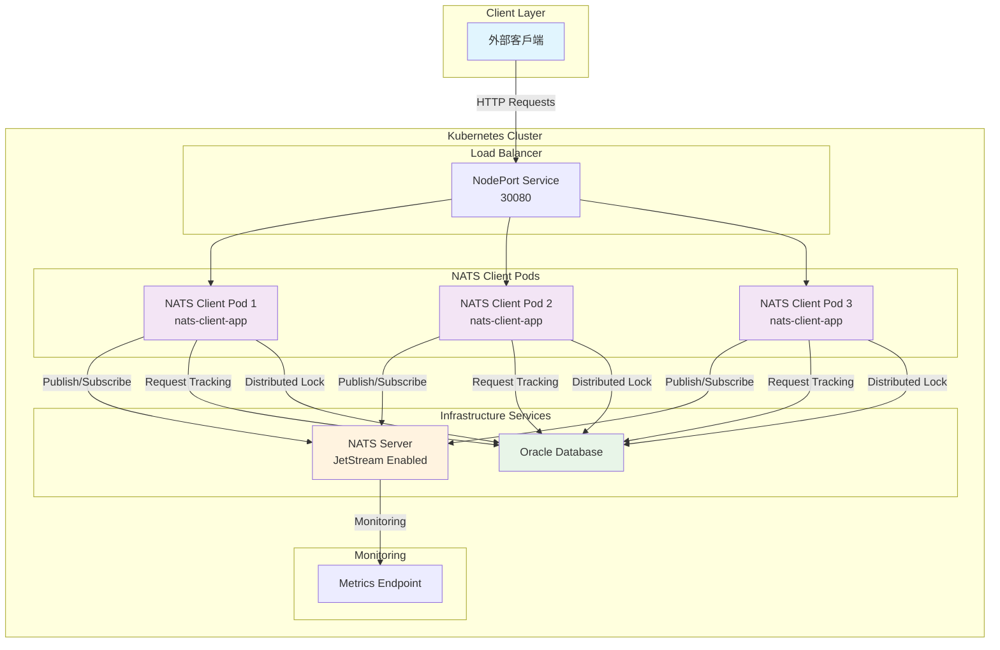
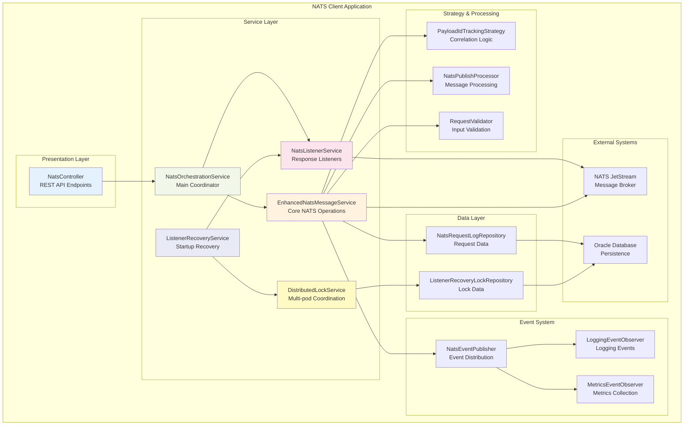
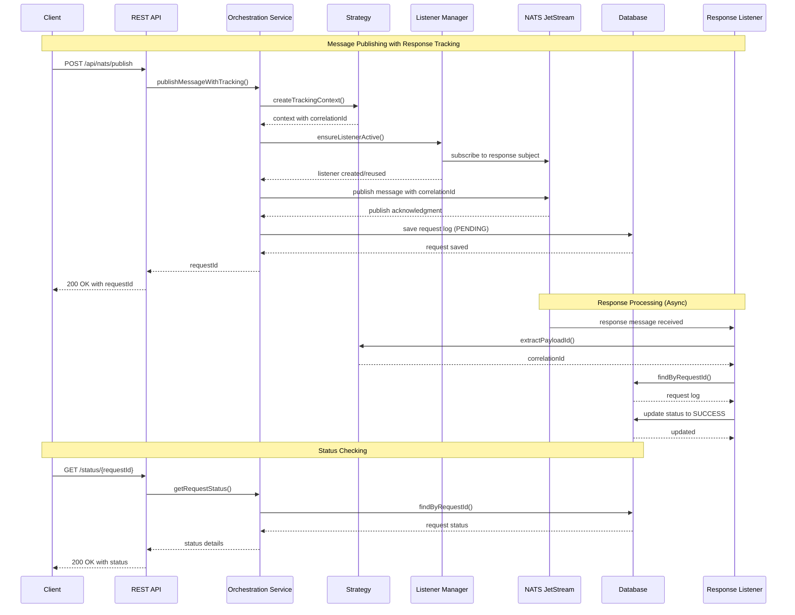
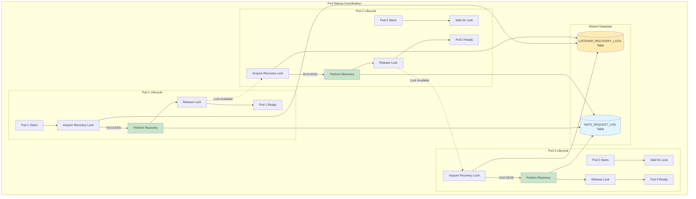
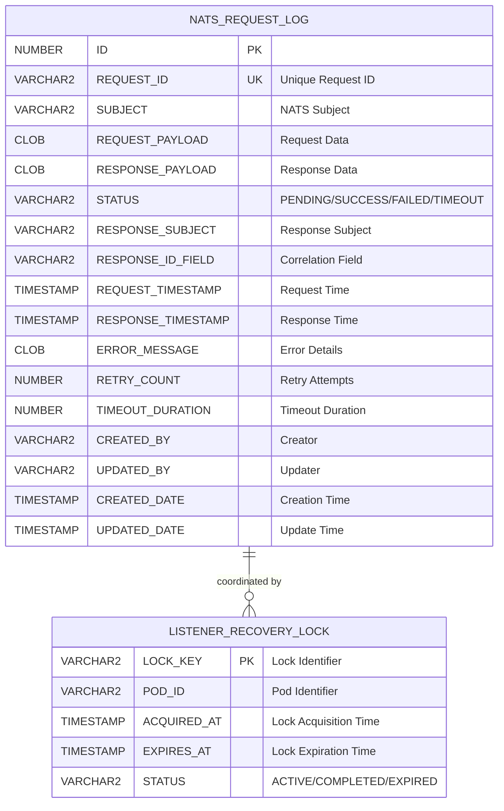
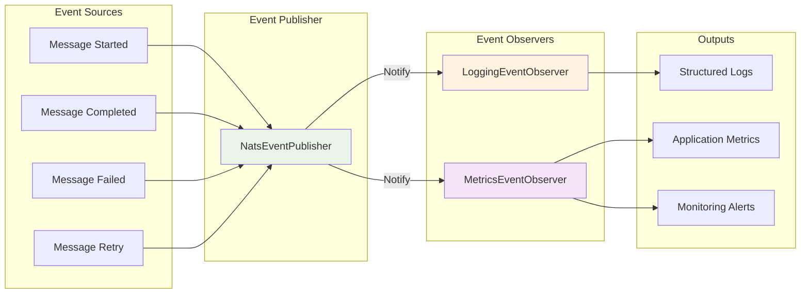

# NATS Client Architecture Diagrams

本文檔包含了 NATS Client 應用程序的詳細架構圖表，使用 Mermaid 格式繪製。

---

## 1. 系統整體架構

---

## 2. 應用程序內部架構

---

## 3. 消息流程架構

---

## 4. 分散式協調架構

---

## 5. 數據庫設計架構

---

## 6. 事件驅動架構

