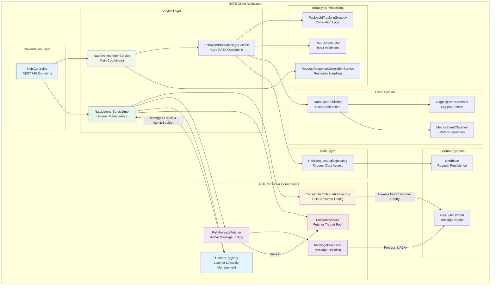
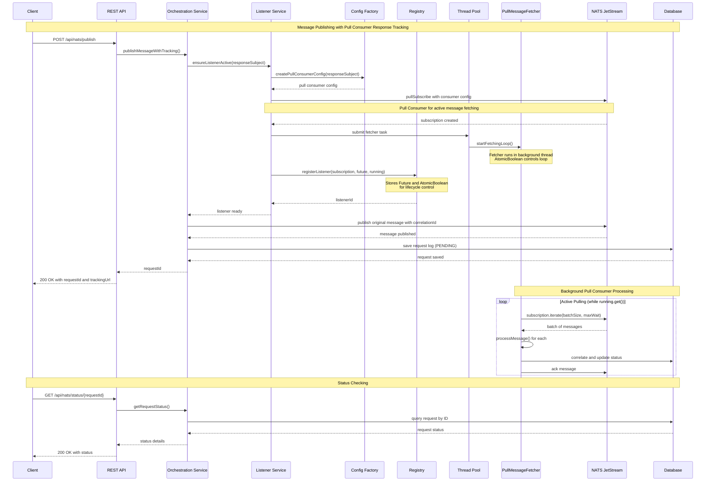
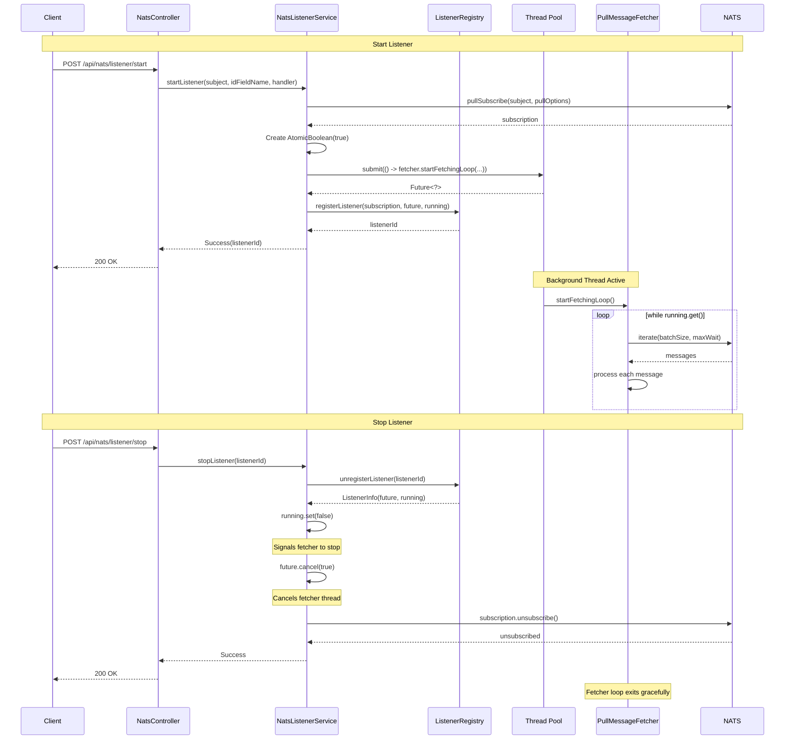
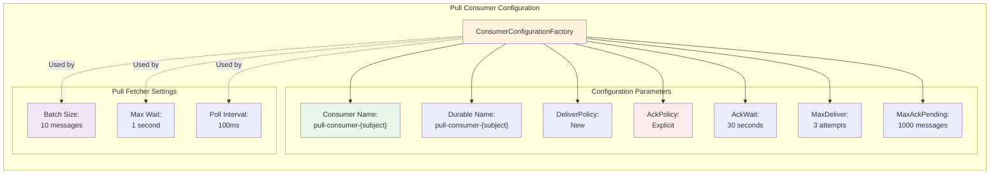
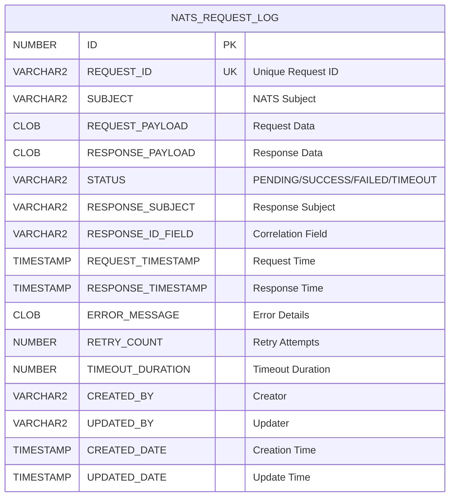
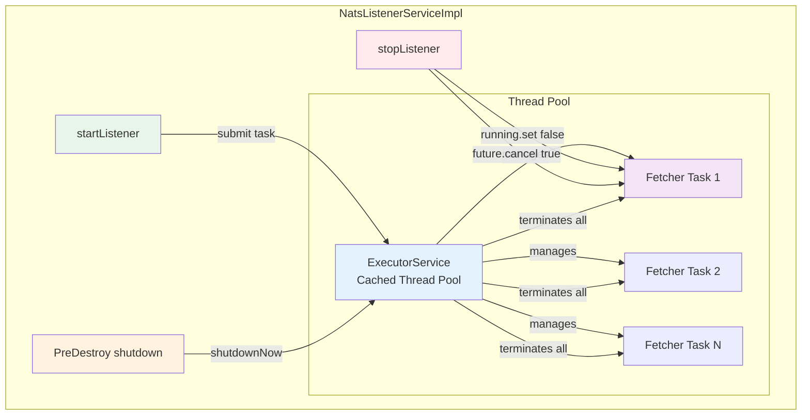
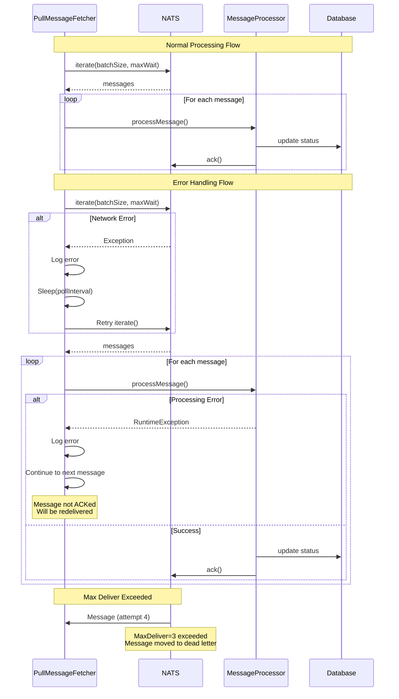

# NATS Client Architecture Diagrams

This document contains detailed architectural diagrams for the NATS Client application using Mermaid format.

---

## 1. Application Internal Architecture

---

## 2. Pull Consumer Message Publishing Flow (Publish & Response Tracking)

---

## 3. Pull Consumer Lifecycle Management

---

## 4. Pull Consumer Configuration Architecture

---

## 5. Database Design Architecture

---

## 6. Pull Consumer Thread Pool Management

---

## 7. Error Handling and Retry Flow

---

## Key Architectural Characteristics

### Pull Consumer Advantages

1. **Active Flow Control**: Client controls message fetching rate
2. **Batch Processing**: Process multiple messages efficiently (10 per batch)
3. **Backpressure Management**: Application can slow down when overloaded
4. **Resource Control**: Thread pool manages concurrent fetcher tasks
5. **Graceful Shutdown**: AtomicBoolean + Future.cancel() ensures clean termination

### Thread Safety

- `ConcurrentHashMap` in ListenerRegistry for thread-safe listener management
- `AtomicBoolean` for safe cross-thread communication
- `Future` for async task lifecycle control
- Immutable `ListenerInfo` record pattern

### SOLID Principles Applied

- **Single Responsibility**: Each component has one clear purpose
  - `PullMessageFetcher`: Message pulling logic
  - `MessageProcessor`: Message processing logic
  - `ListenerRegistry`: Listener lifecycle management
  - `ConsumerConfigurationFactory`: Configuration creation

- **Dependency Inversion**: Dependencies injected via constructor, rely on abstractions

- **Interface Segregation**: Services expose minimal required interfaces
